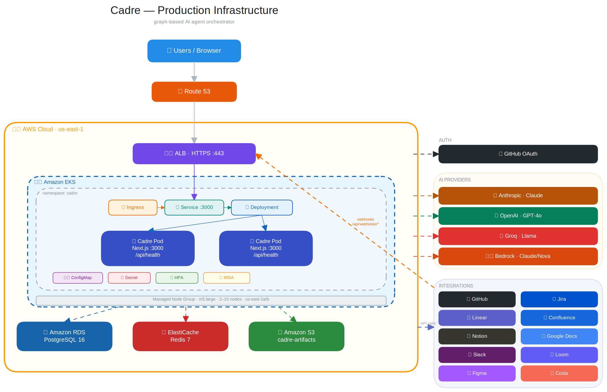

# Cadre

Visual workflow builder for orchestrating AI agents.

[](LICENSE)
[](https://github.com/stxkxs/cadre/actions/workflows/ci.yml)

<!-- screenshot placeholder: add a screenshot or GIF of the workflow editor here -->
<!-- example:  -->

```
┌─────────┐     ┌───────────┐     ┌───────────┐     ┌──────────┐
│  Input   │────▶│  Agent    │────▶│ Condition  │──┬─▶│  Output  │
│          │     │ (Claude)  │     │ (evaluate) │  │  │ (result) │
└─────────┘     └───────────┘     └───────────┘  │  └──────────┘
                                                  │  ┌──────────┐
                                                  └─▶│  Agent   │
                                                     │ (GPT-4o) │
                                                     └──────────┘
```

## What is Cadre?

Cadre is a graph-based workflow builder for designing and running multi-step AI agent pipelines. Connect nodes visually, configure providers, and execute workflows with live streaming output. Build complex orchestration patterns — parallel branches, conditional routing, loops — without writing glue code.

## Features

- **Visual graph editor** — drag-and-drop nodes, snap-to-grid, minimap, undo/redo
- **4 AI providers** — Anthropic (Claude), OpenAI (GPT-4o), Groq (Llama), Claude Code (CLI)
- **Parallel execution** — branches run concurrently with automatic merge
- **Conditional routing** — evaluate expressions to route between branches
- **Live monitoring** — SSE streaming of node outputs during execution
- **Workspace files** — Claude Code nodes can read/write files in a workspace directory
- **Workflow variables** — key-value pairs injected into execution context
- **Export/import** — share workflows as JSON files
- **Pre-built templates** — starter workflows to get going quickly
- **Per-provider cost estimation** — track token usage and costs per run
- **API key encryption** — AES-256-GCM with per-user derived keys
- **Rate limiting** — sliding window rate limits on API endpoints

## Getting Started

### Prerequisites

- Node.js 20+
- pnpm
- [Task](https://taskfile.dev/installation/) (task runner)
- Docker (for local Postgres + Redis)

### 1. Clone and setup

```bash
git clone https://github.com/stxkxs/cadre.git
cd cadre
task setup    # installs deps, creates .env.local, starts Postgres + Redis, runs migrations
```

This runs `pnpm install`, copies `.env.example` → `.env.local`, boots the Docker containers, and migrates the database — all in one command.

### 2. Configure environment

Edit `.env.local` with your values (generate secrets with `task gen:secret`):

| Variable | Description | Required |
|----------|-------------|----------|
| `DATABASE_URL` | PostgreSQL connection string | Yes |
| `AUTH_SECRET` | NextAuth session secret | Yes |
| `AUTH_GITHUB_ID` | GitHub OAuth app client ID | Yes |
| `AUTH_GITHUB_SECRET` | GitHub OAuth app client secret | Yes |
| `ENCRYPTION_SECRET` | API key encryption secret | Yes |
| `NEXTAUTH_URL` | App URL (default: `http://localhost:3000`) | No |
| `DB_POOL_SIZE` | Database connection pool size (default: `10`) | No |

See [`.env.example`](.env.example) for all available variables.

### 3. Set up GitHub OAuth

1. Go to [GitHub Developer Settings → OAuth Apps → New OAuth App](https://github.com/settings/developers)
2. Set **Homepage URL** to `http://localhost:3000`
3. Set **Authorization callback URL** to `http://localhost:3000/api/auth/callback/github`
4. Copy the **Client ID** and **Client Secret** into `AUTH_GITHUB_ID` and `AUTH_GITHUB_SECRET` in `.env.local`

### 4. Start developing

```bash
task up    # starts Postgres + Redis, then the Next.js dev server
```

Open [http://localhost:3000](http://localhost:3000) and sign in with GitHub.

### 5. Add your API keys

Go to **Settings** (gear icon in sidebar) and add API keys for the providers you want to use: Anthropic, OpenAI, and/or Groq. Keys are encrypted at rest with AES-256-GCM.

### 6. Your first workflow

1. Click **New Workflow** and pick a template (or start blank)
2. Add an **Agent** node from the sidebar palette — configure its provider, model, and system prompt
3. Connect an **Input** node to the agent and the agent to an **Output** node
4. Click **Run** (or `Ctrl+Enter`) and watch results stream in the run monitor
5. View completed runs in the **History** tab

## Node Types

| Node | Purpose | Key Config |
|------|---------|------------|
| **Input** | Entry point for the workflow. Captures user input or provides a default value. | Default value |
| **Agent** | Calls an AI model and returns the response. | Provider, model, system prompt, temperature, max tokens, retries, timeout |
| **Condition** | Branches execution based on a JavaScript expression. Has `true` and `false` outputs. | Condition expression (see [Condition Expressions](#condition-expressions)) |
| **Loop** | Repeats a downstream branch up to N iterations while a condition holds. | Max iterations (up to 10), condition expression |
| **Parallel** | Runs all downstream branches concurrently. | Max concurrency |
| **Output** | Collects the final result of the workflow. | Output format (plain text, JSON, markdown) |

## Workflow Variables

Define key-value pairs in the toolbar's **Variables** popover. These are injected into the execution context and can be:

- Referenced in condition/loop expressions as `context.yourKey`
- Exported and imported with workflow JSON files
- Used to parameterize workflows without changing node config

## Condition Expressions

Conditions are JavaScript expressions evaluated against the workflow context. Available data:

- `context.node_<id>_output` — output string from a completed node
- `context.loop_<id>_iteration` — current iteration number inside a loop
- Workflow variables — accessed as `context.yourVariableName`

**Examples:**

```js
// Route based on agent output content
context.node_agent1_output.includes("error")

// Check loop iteration
context.loop_loop1_iteration < 3

// Use a workflow variable
context.threshold > 0.8
```

**Forbidden patterns** (blocked for security): `process`, `require`, `import`, `eval`, `Function`, `globalThis`, `global`, `window`, `document`, `fetch`, `XMLHttpRequest`, `__dirname`, `__filename`. Expressions are also limited to 1000 characters.

## Templates

Cadre ships with **7 workflow templates** to get started quickly:

- **Research Pipeline** — multi-step research with summarization
- **Code Review** — parallel bug detection and style review
- **Content Generator** — draft → edit pipeline
- **Data Analysis** — conditional routing based on data complexity
- **Translation Flow** — parallel multi-language translation with review
- **Support Triage** — classify and route customer queries
- **Iterative Refiner** — loop-based draft refinement with critique cycles

The **Agent Library** page has **10 pre-built agent presets** (Research Assistant, Code Reviewer, Content Writer, Data Analyzer, Fast Summarizer, Code Generator, Translator, Email Drafter, Test Generator, Sentiment Analyzer) that can be copied into any workflow.

## Keyboard Shortcuts

| Shortcut | Action |
|----------|--------|
| `Ctrl/Cmd + S` | Save workflow |
| `Ctrl/Cmd + Enter` | Run workflow |
| `Ctrl/Cmd + Z` | Undo |
| `Ctrl/Cmd + Shift + Z` | Redo |
| `Ctrl/Cmd + C` | Copy selected node |
| `Ctrl/Cmd + V` | Paste node |
| `Ctrl/Cmd + D` | Duplicate selected node |
| `Ctrl/Cmd + A` | Select all nodes and edges |
| `Delete / Backspace` | Delete selected node or edge |

## Architecture



**Engine pipeline**: The graph is validated (cycles, missing providers), then topologically sorted. The scheduler walks the graph in BFS order, batching nodes whose predecessors are all complete. Parallel branches execute concurrently via `Promise.all`. Each node has configurable timeout and retry with exponential backoff.

**Tech stack**: Next.js 16 (App Router), TypeScript, Tailwind CSS v4, shadcn/ui, React Flow, Zustand, Drizzle ORM, PostgreSQL, NextAuth v5.

## Deployment

### Docker

```bash
task docker:build    # build the production image
task docker:run      # run it locally on :3000
```

### Kubernetes (Helm)

```bash
task helm:lint       # validate the chart
task helm:template   # dry-run render
task helm:install    # deploy to current k8s context
```

See [`helm/cadre/`](helm/cadre/) for configurable values.

## Task Reference

Run `task --list` to see all available tasks. Highlights:

**Development**
| Command | Description |
|---------|-------------|
| `task setup` | First-time bootstrap (install, env, infra, migrate) |
| `task up` | Start infra + dev server |
| `task dev` | Next.js dev server only |
| `task build` | Production build |
| `task start` | Run production server (after build) |

**Testing & Quality**
| Command | Description |
|---------|-------------|
| `task lint` | ESLint |
| `task lint:fix` | ESLint with auto-fix |
| `task test` | Run tests once |
| `task test:watch` | Watch mode |
| `task test:coverage` | Tests with coverage report |
| `task ci` | Full CI pipeline (lint + test + build) |

**Database**
| Command | Description |
|---------|-------------|
| `task db:generate` | Generate migration files from schema changes |
| `task db:migrate` | Run pending migrations |
| `task db:push` | Push schema directly (dev only) |
| `task db:studio` | Open Drizzle Studio (database GUI) |
| `task db:check` | Verify database connection |
| `task db:reset` | Drop and recreate database (prompts for confirmation) |

**Infrastructure**
| Command | Description |
|---------|-------------|
| `task infra:up` | Start Postgres + Redis containers |
| `task infra:down` | Stop containers |
| `task infra:destroy` | Stop containers and delete volumes (prompts) |
| `task infra:logs` | Tail container logs |
| `task infra:ps` | Container status |

**Utilities**
| Command | Description |
|---------|-------------|
| `task gen:secret` | Generate a random base64 secret |
| `task clean` | Remove build artifacts and caches |
| `task nuke` | Full clean including node_modules (prompts) |

## Contributing

See [CONTRIBUTING.md](CONTRIBUTING.md) for development setup, code style, and PR guidelines.

## License

[MIT](LICENSE)
